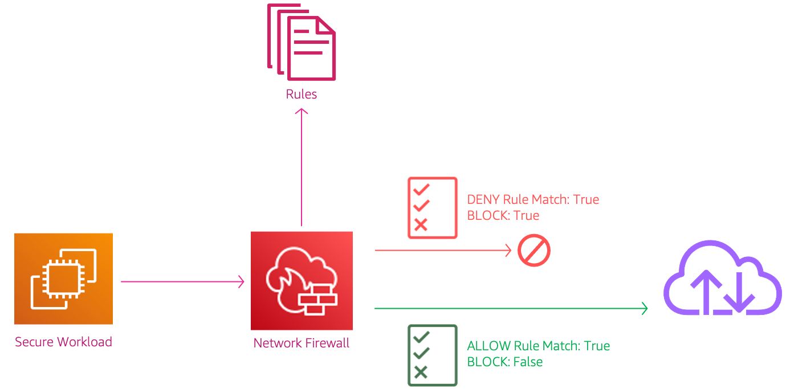
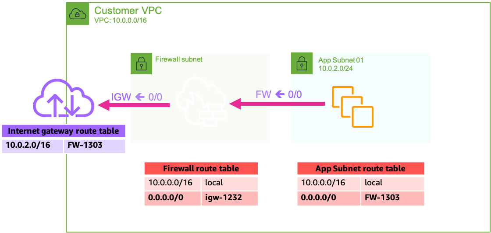
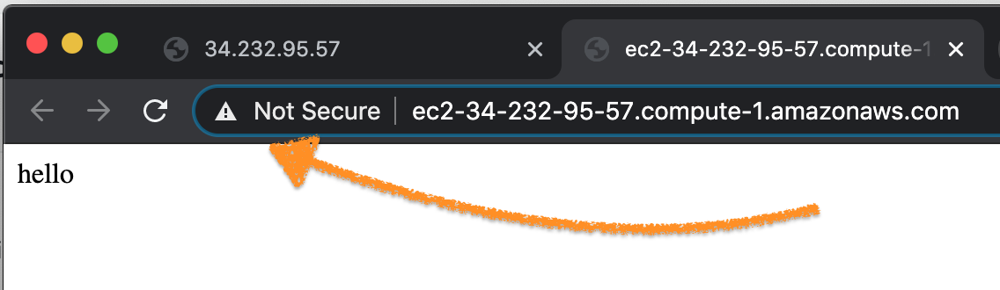
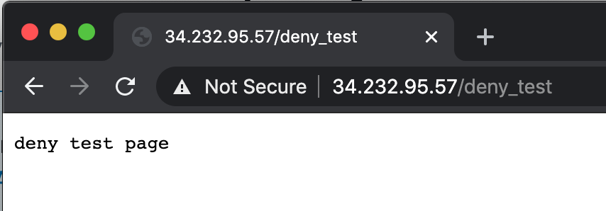
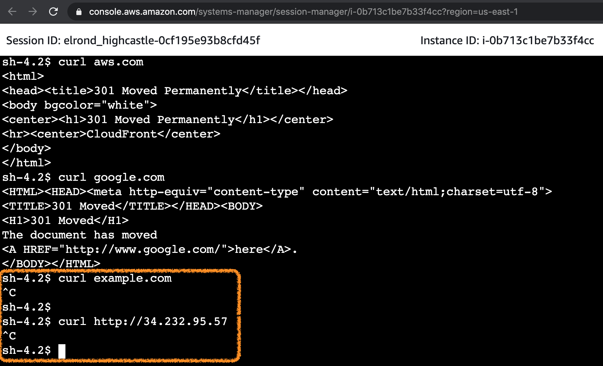
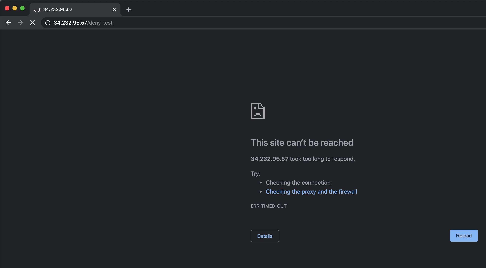
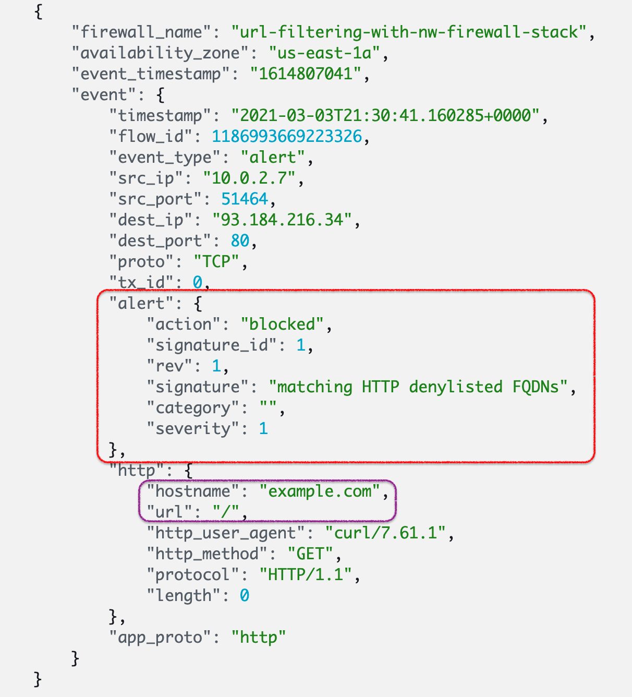
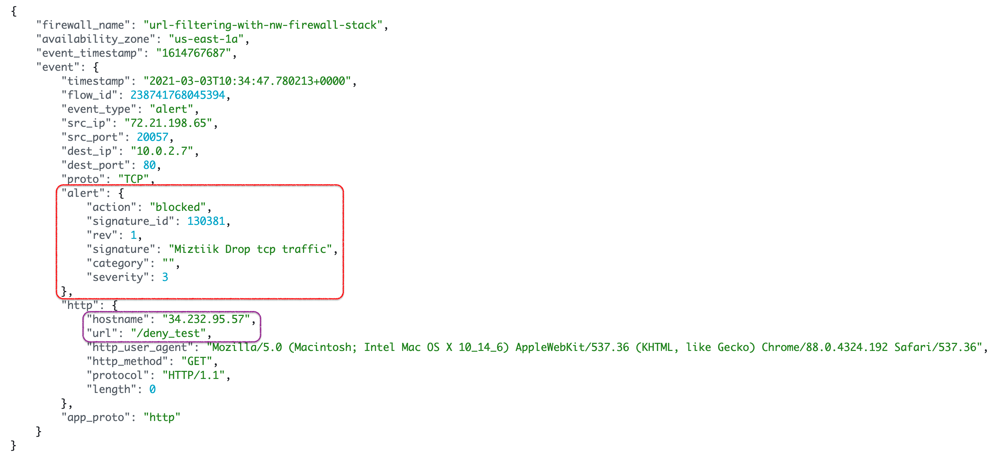

# Firewall for Url filtering

Mystique Unicorn App is looking to deploy a firewall that should _allow_ or _drop_ traffic based on customizable rules. The team is looking for your help to achieve this. Can you help them?



## 🎯 Solutions

Up until very recently, network prevention has been quite limited,
- Create _Security Groups_ to limit various types of _layer 3 and 4 traffic_ 
- _or_ Create _Network Access Control Lists (NACL)_ to limit _layer 3 and 4 traffic_
- _or_ Route traffic through a custom network appliance running as an EC2 instance 

This is not enough in many use-cases, You also want the ability to take action based on the payload. The recently launched AWS Network Firewall<sup>[1]<sup> provides active traffic flow inspection so you can identify and block vulnerability exploits using signature-based detection. AWS Network Firewall also offers web filtering that can stop traffic to known bad URLs and monitor fully qualified domain names. At launch you have the following capabilities.
- _Allow_ or _Deny_ based on source IP and/or port, destination IP and/or port, and protocol (also known as 5-tuple)
- _Allow_ or _Deny_ based upon domain names
- _Allow_ or _Deny_ based upon Suricata-compatible IPS rules





In this demo, We will build a architecture, similar to the one shown above. We will start backwards so that all the dependencies are satisfied.

1.  ## 🧰 Prerequisites

    This demo, instructions, scripts and cloudformation template is designed to be run in `us-east-1`. With few modifications you can try it out in other regions as well(_Not covered here_).

    - 🛠 AWS CLI Installed & Configured - [Get help here](https://youtu.be/TPyyfmQte0U)
    - 🛠 AWS CDK Installed & Configured - [Get help here](https://www.youtube.com/watch?v=MKwxpszw0Rc)
    - 🛠 Python Packages, _Change the below commands to suit your OS, the following is written for amzn linux 2_
      - Python3 - `yum install -y python3`
      - Python Pip - `yum install -y python-pip`
      - Virtualenv - `pip3 install virtualenv`

1.  ## ⚙️ Setting up the environment

    - Get the application code

      ```bash
      git clone https://github.com/miztiik/url-filtering-with-nw-firewall
      cd url-filtering-with-nw-firewall
      ```

1.  ## 🚀 Prepare the dev environment to run AWS CDK

    We will use `cdk` to make our deployments easier. Lets go ahead and install the necessary components.

    ```bash
    # You should have npm pre-installed
    # If you DONT have cdk installed
    npm install -g aws-cdk

    # Make sure you in root directory
    python3 -m venv .venv
    source .venv/bin/activate
    pip3 install -r requirements.txt
    ```

    The very first time you deploy an AWS CDK app into an environment _(account/region)_, you’ll need to install a `bootstrap stack`, Otherwise just go ahead and deploy using `cdk deploy`.

    ```bash
    cdk bootstrap
    cdk ls
    # Follow on screen prompts
    ```

    You should see an output of the available stacks,

    ```bash
    url-filtering-with-nw-firewall-vpc-stack
    url-filtering-with-nw-firewall-stack
    secured-workload-on-ec2-stack
    ```

1.  ## 🚀 Deploying the application

    Let us walk through each of the stacks,

    - **Stack: url-filtering-with-nw-firewall-vpc-stack**

      This stack will create an custom VPC to host our firewall and test workload.

      Initiate the deployment with the following command,

      ```bash
      cdk deploy url-filtering-with-nw-firewall-vpc-stack
      ```

    - **Stack: url-filtering-with-nw-firewall-stack**

      This stack will the network firewall in the _firewall subnet_. We will do create _stateful_ rules as they offer better control. We will forward all _stateless_ traffic to through the _stateful_ rules. This way all traffic flow through our rule set.

      This stack will create `3` rules,
        - `ALLOW-For-Domains` - This rule will allows traffic only to these two domains`"aws.com", "google.com"` from the workloads in the VPC.
        - `DENY-For-Domains` - This rule will denies traffic to these two domains`".example.com",".modi-am-i.com"` from the workloads in the VPC.
        - `DENY-On-Url` - Any traffic to with text `deny_test` in the url will be denied. 
          **NOTE:** - This rule is not attached to the firewall, we will later add this during our testing phase.

      Initiate the deployment with the following command,

      ```bash
      cdk deploy url-filtering-with-nw-firewall-stack
      ```

      After successfully deploying the stack, Check the `Outputs` section of the stack. You will find the `NetworkFirewallEndpoints` that does traffic routing between subnets.

    - **Stack: secured-workload-on-ec2-stack**

      This stack deploys a simple EC2 instance that also runs a webserver with two webpages - One for `/` page and `deny_test` page. You can also login to the instance using SSM Session Manager<sup>[2]<sup>.

      Initiate the deployment with the following command,

      ```bash
      cdk deploy secured-workload-on-ec2-stack
      ```

      After successfully deploying the stack, Check the `Outputs` section of the stack. You will find the `PublicWorkloadInstance` instance id and the `WebServerUrl`.


1.  ## 🔬 Testing the solution

    - Use the `WebServerUrl` from the previous stack on your browser. You should be able to access the `/` page and also the `deny_test` page. Make sure to use `http` and not `https` as the webserver is not configured with any certificates. For example `http://34.232.95.57` and `http://34.232.95.57/deny_test`

    

    

    - Now login to the EC2 instance using SSM Session Manager<sup>[2]<sup>
    - Try to access the allowed and denied domains

    ```sh
    curl aws.com
    curl google.com
    curl example.com
    ```

    

    You will notice that the first two requests were successful, whereas the last two were blocked by the firewall. Now let try to add the `DENY-On-Url` to our firewall.

    - Goto VPC Service > Network Firewalls > `url-filtering-with-nw-firewall-stack`
    - Under Stateful rule groups > Add rule groups > Add stateful rule groups to the firewall policy
    - Select `DENY-On-Url` > Add stateful rule group
  
    Now try to access the `deny_test` page in your browser, preferably in private mode to avoid fetching locally cached page, Your request should time out

    

    Now lets check our logs to see why our traffic was blocked. 
    
    You can notice that the request does matches our deny FQDN rule and the traffic was _blocked_.

    If you poke around the logs, you will also find the logs for _deny_test_ url. This request has the custom error message that we added in the deny rule -  `Miztiik drop tcp traffic`
    

1.  ## 📒 Conclusion

      Here we have demonstrated how to use network firewall to _allow_ of _deny_ request based on the domain names. The firewall also gives us the ability to deny request to unsecure urls as well.
1.  ## 🧹 CleanUp

    If you want to destroy all the resources created by the stack, Execute the below command to delete the stack, or _you can delete the stack from console as well_

    - Resources created during [Deploying The Application](#-deploying-the-application)
    - Delete CloudWatch Lambda LogGroups
    - _Any other custom resources, you have created for this demo_

    ```bash
    # Delete from cdk
    cdk destroy

    # Follow any on-screen prompts

    # Delete the CF Stack, If you used cloudformation to deploy the stack.
    aws cloudformation delete-stack \
      --stack-name "MiztiikAutomationStack" \
      --region "${AWS_REGION}"
    ```

    This is not an exhaustive list, please carry out other necessary steps as maybe applicable to your needs.

## 📌 Who is using this

This repository aims to show how to use network firewall to new developers, Solution Architects & Ops Engineers in AWS. Based on that knowledge these Udemy [course #1][103], [course #2][102] helps you build complete architecture in AWS.

### 💡 Help/Suggestions or 🐛 Bugs

Thank you for your interest in contributing to our project. Whether it is a bug report, new feature, correction, or additional documentation or solutions, we greatly value feedback and contributions from our community. [Start here](/issues)

### 👋 Buy me a coffee

[](https://ko-fi.com/Q5Q41QDGK) Buy me a [coffee ☕][900].

### 📚 References

1. [Docs: AWS Network Firewall][1]

1. [Docs: AWS SSM Session Managerhttps://aws.amazon.com/network-firewall][2]


### 🏷️ Metadata


**Level**: 300

[1]: https://aws.amazon.com/network-firewall
[2]: https://docs.aws.amazon.com/systems-manager/latest/userguide/session-manager.html


[100]: https://www.udemy.com/course/aws-cloud-security/?referralCode=B7F1B6C78B45ADAF77A9
[101]: https://www.udemy.com/course/aws-cloud-security-proactive-way/?referralCode=71DC542AD4481309A441
[102]: https://www.udemy.com/course/aws-cloud-development-kit-from-beginner-to-professional/?referralCode=E15D7FB64E417C547579
[103]: https://www.udemy.com/course/aws-cloudformation-basics?referralCode=93AD3B1530BC871093D6
[899]: https://www.udemy.com/user/n-kumar/
[900]: https://ko-fi.com/miztiik
[901]: https://ko-fi.com/Q5Q41QDGK
